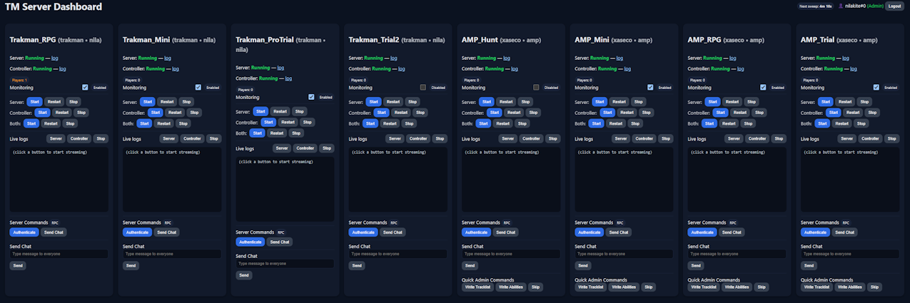

# TM Web Management Interface & Monitoring

A single-file Flask web UI for running and supervising multiple **TrackMania Forever** dedicated servers and controllers (**Trakman** or **XAseco**) on **Windows**.

Includes Discord OAuth login, per-group admin permissions, live log streaming over WebSocket, one-click start/stop/restart, player-count widgets, and an automatic monitor that can self-heal or gracefully restart instances when empty.

<p align="center">
  
</p>

---

## Table of Contents

- [Features](#features)
- [Tested With](#tested-with)
- [Prerequisites](#prerequisites)
- [XAseco Fix](#xaseco-fix)
- [Folder Layout](#folder-layout)
- [Installation](#installation)
- [Configuration](#configuration)
  - [.env](#env)
  - [servers.yaml](#serversyaml)
  - [Caddy](#caddy)
- [Running](#running)
- [Using the Web UI](#using-the-web-ui)
- [Permissions Model](#permissions-model)
- [Monitoring Details](#monitoring-details)
- [HTTP & WS Endpoints](#http--ws-endpoints)
- [Troubleshooting](#troubleshooting)
- [Security Notes](#security-notes)
- [Quick Start](#quick-start)

---

# Features

- ✅ **Dashboard** of all instances (server + controller status, logs, player count)
- 🔐 **Discord OAuth** login with superadmin & per-group admin access
- 🧪 **Controls**: start/stop/restart server/controller/both
- 💬 **Chat & Commands**  
  - XAseco: `/admin ...` via XML-RPC `ChatSend`  
  - Trakman: `//...` directly in Trakman console via `pm2 attach` (Windows uses `wexpect`)
- 🔄 **Monitoring loop** (configurable):  
  Detects downed processes, starts missing pieces (if monitoring is enabled), and performs **graceful restarts** when empty after an uptime threshold
- 🔔 **Discord notifications** (webhook + optional mentions)
- 🔌 **WebSocket** live log tailing
- 🛡️ Designed to run behind **Caddy**/HTTPS (Cloudflare compatible)

---

# Tested With

- **Trakman**: 1.6.1 (Node + pm2)
- **XAseco**: 1.16 (PHP 5.6 + modernizer/mysqli)
- **Python**: 3.12.x
- **Windows** host

---

# Prerequisites

- **TrackMania Dedicated Server**  
  Download: http://tm.cloudzor.ch/tmnf/TrackmaniaServer_2011-02-21.zip  
  Create a dedicated server account: https://players.trackmaniaforever.com/main.php?view=dedicated-servers
- **Trakman Controller**: https://github.com/lythx/trakman (requires Node + pm2)
- **XAseco Controller**: https://www.gamers.org/tmn/xaseco_116.zip
- **Caddy** (optional reverse proxy + TLS): https://caddyserver.com/download
- **PHP 5.6** (for XAseco): https://windows.php.net/downloads/releases/archives/php-5.6.9-Win32-VC11-x64.zip
- **Python 3.12.x**: https://www.python.org/downloads/

---

# XAaseco Fix
- To implement & inject server login as MasterAdmin (plugins/plugin.server_admin_bridge.php) to XAseco for use via XML-RPC chatSend method
- Add server login into "xaseco/config.xml" as MasterAdmin
- For manual fix, check below (else download xaseco-patch.zip)
```
## Fix 1 - playerChat - aseco.php
	/**
	 * Receives chat messages and reacts on them.
	 * Reactions are done by the chat plugins.
	 */
	function playerChat($chat) {

		// verify login
		if ($chat[1] == '' || $chat[1] == '???') {
			trigger_error('playerUid ' . $chat[0] . 'has login [' . $chat[1] . ']!', E_USER_WARNING);
			$this->console('playerUid {1} attempted to use chat command "{2}"',
			               $chat[0], $chat[2]);
			return;
		}

		// ignore master server messages on relay
		if ($this->server->isrelay && $chat[1] == $this->server->relaymaster['Login'])
			return;

		// check for chat command '/' prefix
		$command = $chat[2];
		if ($command != '' && $command[0] == '/') {
			// remove '/' prefix
			$command = substr($command, 1);

			// split strings at spaces and add them into an array
			$params = explode(' ', $command, 2);
			$translated_name = str_replace('+', 'plus', $params[0]);
			$translated_name = str_replace('-', 'dash', $translated_name);

			// check if the function and the command exist
			if (function_exists('chat_' . $translated_name)) {
				// insure parameter exists & is trimmed
				if (isset($params[1]))
					$params[1] = trim($params[1]);
				else
					$params[1] = '';

				// get & verify player object (or fabricate for server login)
				$author = $this->server->players->getPlayer($chat[1]);
				
				if ((!$author || $author->login == '') &&
					isset($this->server->serverlogin) &&
					strcasecmp($chat[1], $this->server->serverlogin) === 0 &&
					$chat[0] == $this->server->id) {
					// Create a temporary "synthetic" author ONLY for this chat command.
					$author = new Player();
					$author->pid         = isset($this->server->id) ? intval($this->server->id) : 0; // TMF PlayerId
					$author->id          = 0;            // DB id (none) – keep 0 to avoid DB side-effects
					$author->login       = $this->server->serverlogin;
					$author->nickname    = isset($this->server->nickname) ? $this->server->nickname : $this->server->serverlogin;
					// If your masteradmin entry has an IP restriction, set this to a matching IP:
					$author->ip          = $this->server->ip ?: '127.0.0.1';
					$author->isspectator = true;
					$author->unlocked    = true; // bypass lock password checks
					$author->rights      = 3;    // informational only; allowAbility() uses admin lists
				}
				
				// proceed if we have an author now
				if ($author && $author->login != '') {
					// log console message
					$this->console('player {1} used chat command "/{2} {3}"',
								$chat[1], $params[0], $params[1]);
				
					// save circumstances in array
					$chat_command = array();
					$chat_command['author'] = $author;
					$chat_command['params'] = $params[1];
				
					// call the function which belongs to the command
					call_user_func('chat_' . $translated_name, $this, $chat_command);
				} else {
					trigger_error('Player object for \'' . $chat[1] . '\' not found!', E_USER_WARNING);
					$this->console('player {1} attempted to use chat command "/{2} {3}"',
								$chat[1], $params[0], $params[1]);
				}
			} elseif ($params[0] == 'version' ||
			          ($params[0] == 'serverlogin' && $this->server->getGame() == 'TMF')) {
				// log built-in commands
				$this->console('player {1} used built-in command "/{2}"',
				               $chat[1], $command);
			} else {
				// optionally log bogus chat commands too
				if ($this->settings['log_all_chat']) {
					if ($chat[0] != $this->server->id) {
						$this->console('({1}) {2}', $chat[1], stripColors($chat[2], false));
					}
				}
			}
		} else {
			// optionally log all normal chat too
			if ($this->settings['log_all_chat']) {
				if ($chat[0] != $this->server->id && $chat[2] != '') {
					$this->console('({1}) {2}', $chat[1], stripColors($chat[2], false));
				}
			}
		}
	}  // playerChat

## Fix 2 - playerConnect - aseco.php
	function playerConnect($player) {
	
		// request information about the new player
		// (removed callback mechanism here, as GetPlayerInfo occasionally
		//  returns no data and then the connecting login would be lost)
		$login = $player[0];
	
		// NEVER treat the dedicated account as a real player (TMF only)
		if ($this->server->getGame() == 'TMF' &&
			isset($this->server->serverlogin) &&
			strcasecmp($login, $this->server->serverlogin) === 0) {
			return;
		}
	
		if ($this->server->getGame() == 'TMF') {
			$this->client->query('GetDetailedPlayerInfo', $login);
			$playerd = $this->client->getResponse();
			$this->client->query('GetPlayerInfo', $login, 1);
		} else {  // TMN/TMS/TMO
			$this->client->query('GetPlayerInfo', $login);
		}
		$player = $this->client->getResponse();

## Fix 3 - serverSync - aseco.php
		// update players/relays lists
		if (!empty($response['playerlist'])) {
			foreach ($response['playerlist'] as $player) {
				$login = $player['Login'];
				if ($this->server->getGame() == 'TMF' &&
					isset($this->server->serverlogin) &&
					strcasecmp($login, $this->server->serverlogin) === 0) {
					continue; // don’t seed the dedicated account
				}
				$this->playerConnect(array($login, ''));
			}
		}
	}  // serverSync

## Fix 4 - re_calculateClock - plugin.records_eyepiece.php
function re_calculateClock ($timezone) {
    global $re_config;

    // Resolve desired timezone with safe fallbacks
    $tzWant = trim((string)$timezone);
    if ($tzWant === '') {
        $tzWant = isset($re_config['CLOCK_WIDGET'][0]['TIMEZONE'][0])
            ? (string)$re_config['CLOCK_WIDGET'][0]['TIMEZONE'][0]
            : '';
        if ($tzWant === '') {
            $tzWant = ini_get('date.timezone') ?: date_default_timezone_get() ?: 'UTC';
        }
    }
    try { $zoneWant = new DateTimeZone($tzWant); }
    catch (Exception $e) { $zoneWant = new DateTimeZone('UTC'); $tzWant = 'UTC'; }

    // TIMEFORMAT fallback
    $fmt = (!empty($re_config['CLOCK_WIDGET'][0]['TIMEFORMAT'][0]))
        ? (string)$re_config['CLOCK_WIDGET'][0]['TIMEFORMAT'][0]
        : 'H:i';

    $now   = new DateTime('now', $zoneWant);
    $time  = $now->format($fmt);
    $abbr  = $now->format('T');   // wanted timezone’s abbreviation

    return array('timeformat' => $time, 'timezone' => $abbr);
}

```
---

# Folder Layout

Place these in a folder (e.g. `WebUI/`):
```
WebUI/
|-> app.py
|-> index.html
|-> servers.yaml
|-> .env
|-> requirements.txt
```
---

# Installation
```
cd C:\Users\<USER>\Desktop\WebUI
pip install -r requirements.txt
Flask==2.3.3
flask-sock==0.7.0
simple-websocket==0.10.1
eventlet==0.33.3
Authlib==1.3.0
requests==2.32.3
PyYAML==6.0.2
psutil==5.9.8
python-dotenv==1.0.1
wexpect==4.0.0 ; sys_platform == "win32"
Note: wexpect is optional and only used to pm2 attach to Trakman for interactive //... commands on Windows.
```
# Configuration
## .env
```
# Copy to .env and fill in for local dev; in production set real env variables.
SERVERS_YAML=servers.yaml
SESSION_SECRET=please-change-me
DISCORD_CLIENT_ID=
DISCORD_CLIENT_SECRET=
OAUTH_REDIRECT_URL=http://localhost:8000/auth/callback
DISCORD_WEBHOOK=
# Optional cookie domain (leave unset for automatic)
# SESSION_COOKIE_DOMAIN=.example.com
PREFERRED_URL_SCHEME=https
```
## servers.yaml
```
# ========= Discord / App settings =========
# COPY this file to servers.yaml (do NOT commit the real one).
# use .env.example file for env variables.

settings:
  # Strong random string; override with env SESSION_SECRET in prod
  session_secret: "change-me-dev-only"
  # Discord OAuth; for dev you can keep these blank and use env vars instead
  discord_client_id: ""
  discord_client_secret: ""
  # For local dev; in prod set OAUTH_REDIRECT_URL env or here
  oauth_redirect_url: "http://localhost:8000/auth/callback"
  # Optional: Discord webhook for monitor notifications (leave empty to disable)
  discord_webhook: ""

  # Optional tag shown by backend if you use XAseco slash sender
  xaseco_slash_sender: ""

  # Global superadmins (Discord user IDs as strings)
  admin_discord_ids: []

  # Per-group instance admins (Discord user IDs)
  group_admins: {}

  # Optional: who can SEE which groups (not admin rights)
  user_groups: {}

  # ----- Monitor settings -----
  monitor_refresh_seconds: 300
  monitor_state_file: "./monitor-flags.json"

  # ----- Trakman policy -----
  trakman_restart_hours: 27
  trakman_player_check_minutes: 15

# Optional: path to PHP 5.6 if you launch XAseco via php.exe directly
php56: "C:\\xampp\\php56\\php.exe"

instances:
  # --------- Example Trakman controller ----------
  - name: "Trakman_RPG"
    group: "group-a"
    type: "trakman"
    server_proc_name: "ExampleServer.exe"
    server_bat: "C:\\path\\to\\server\\StartServer.bat"
    trakman_dir: "C:\\path\\to\\trakman"
    pm2_name: "Trakman_RPG"
    server_log: "C:\\path\\to\\server\\Logs\\GameLog.txt"
    controller_log: "C:\\path\\to\\trakman\\logs\\combined.log"
    xmlrpc_host: "127.0.0.1"
    xmlrpc_port: 5000
    xmlrpc_login: "SuperAdmin"
    xmlrpc_password: "CHANGE_ME"
    xmlrpc_path: "/RPC2"

    restart_after_hours: 27
    player_check_minutes: 15

    restart_pre_commands:
      - "//svms"
      - "//s"
      - "//sd"
    restart_wait_before_start: 5
    restart_wait_after_start: 30
    restart_post_commands:
      - "//kc"

  # --------- Example XAseco controller ----------
  - name: "XAseco_RPG"
    group: "group-b"
    type: "xaseco"
    server_proc_name: "ExampleXAseco.exe"
    server_bat: "C:\\path\\to\\xaseco\\Start.bat"
    xaseco_dir: "C:\\path\\to\\xaseco"
    xaseco_name: "XAseco_RPG"
    controller_log: "C:\\path\\to\\xaseco\\logfile.txt"
    server_log: "C:\\path\\to\\server\\Logs\\GameLog.txt"
    xmlrpc_host: "127.0.0.1"
    xmlrpc_port: 5001
    xmlrpc_login: "SuperAdmin"
    xmlrpc_password: "CHANGE_ME"
    xmlrpc_path: "/RPC2"

    restart_after_hours: 27
    player_check_minutes: 15

    restart_chat_pre:
      - "/admin writetracklist"
      - "/admin writeabilities"
      - "/admin skip"
    restart_wait_before_shutdown: 60
    shutdown_command: "/admin shutdownall"
    restart_wait_after_start: 30
```
# Caddy
Your Caddyfile can live where Caddy expects it (e.g. C:\caddy\Caddyfile).

If you use **Cloudflare Origin Certificates** on the origin, ensure these files exist:

C:\caddy\cf-origin.crt

C:\caddy\cf-origin.key

## Caddy config
```
www.example.com {
    redir https://example.com{uri} permanent
}

example.com {
    # If terminating TLS here, supply cert/key paths or use `tls internal` for dev
    # tls /path/to/cert.crt /path/to/key.key
    encode zstd gzip

    @nocache path_regexp nocache ^/(auth/.*|login)$
    header @nocache Cache-Control "no-store"

    @home path /
    header @home Cache-Control "no-store"

    reverse_proxy 127.0.0.1:8000 {
        transport http {
            versions 1.1
        }
        # If behind Cloudflare, pass the real client IP:
        # header_up X-Real-IP {header.CF-Connecting-IP}
        header_up X-Forwarded-Proto {scheme}
    }
}
```
# Running
## Development
python app.py

The app listens on http://0.0.0.0:8000. If using Caddy/HTTPS, browse to your domain.

## Production
Keep app.py, .env, and servers.yaml together as the working directory.

Run under a Windows service manager (e.g., NSSM) and place Caddy in front for TLS.

## Using the Web UI
Visit your domain.

Click Login with Discord.

Each instance card shows:

Server & controller status with log links (if you’re an admin for that instance)

Monitoring toggle

Start / Restart / Stop for Server, Controller, or Both

Send Chat input

Trakman: //... runs in Trakman console (pm2 attach)

Plain text broadcasts via ChatSend

XAseco: /admin ... via ChatSend

## Permissions Model
Superadmins (settings.admin_discord_ids) manage everything.

Group admins (settings.group_admins.<group>) manage instances in that group.

user_groups controls visibility only (what users can see).

Permissions are enforced on every API call; the UI also hides buttons where possible.

## Monitoring Details
Cadence: settings.monitor_refresh_seconds (default 300s).

Per-instance “monitoring enabled” is persisted to monitor-flags.json (path in settings).

Per instance:
restart_after_hours: uptime threshold before considering a restart

player_check_minutes: minimum interval between checks

If empty at check time:

Trakman: pre-commands → server start → post-commands (defaults: //svms, //s, //sd, wait, start, wait, //kc)

XAseco: send /admin pre-commands → /admin shutdownall → restart server & controller

Discord webhook alerts announce outages/recoveries; optional mentions via MENTION_TEXT.

## HTTP & WS Endpoints
GET / — UI

GET /api/me — auth state

GET /api/status — status for all instances

POST /api/control — {name, action: start|stop|restart, target: server|controller|both}

GET /api/log/<name>/<server|controller> — raw log download/stream

GET /api/monitor — monitor info + next sweep ETA

POST /api/monitor/toggle — enable/disable monitoring per instance

POST /api/monitor/force — force a notification sweep (superadmin only)

POST /api/playercount — live player count (tiny TTL cache)

POST /api/dedi/chatsend — send chat / run command (permission-checked)

POST /api/dedi/authenticate — test XML-RPC auth

WS /ws/log/<name>/<server|controller> — live tail via WebSocket

# Troubleshooting
Login succeeds but you appear logged out

Check SESSION_COOKIE_DOMAIN (for https://example.com, use .example.com) and PREFERRED_URL_SCHEME=https.


WebSockets fail behind proxy/CDN

Ensure HTTP/1.1 and WS upgrades are allowed (Caddy config above works).


“GBXRemote 2” errors on XML-RPC

The app auto-falls back to GBX binary calls when it detects GBXRemote on the other side.


Trakman // commands don’t execute

Confirm pm2 is installed, pm2_name matches, and wexpect is installed on Windows.


Player count shows zero/unavailable

Verify XML-RPC credentials and port match your dedicated server config.


Logs not visible

Check server_log / controller_log paths and read permissions for the Python process.

# Security Notes
Do not commit .env or real passwords in servers.yaml.

Limit who can access the site until admin lists are set.

Consider running the Python process under a restricted Windows account.

Put an HTTPS proxy (Caddy/Cloudflare) in front if exposed publicly.

# Quick Start
Install prerequisites (Python, PHP 5.6 for XAseco, Node + pm2 for Trakman).

Prepare and test your dedicated servers + controllers.

Put app.py, index.html, servers.yaml, .env, and requirements.txt in WebUI/.

pip install -r requirements.txt

python app.py

(Optional) Enable Caddy and visit your HTTPS domain.
